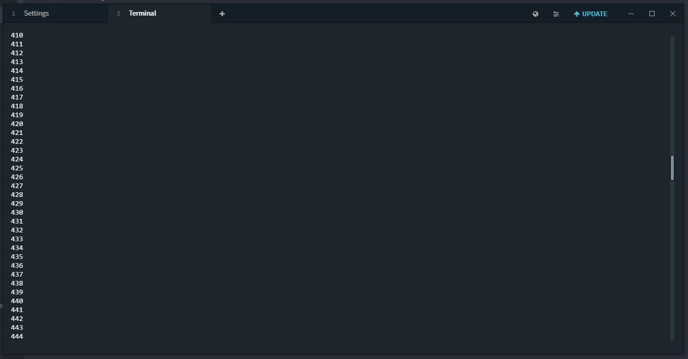

terminus-scrollbar

---

[Terminus](https://eugeny.github.io/terminus/) plugin for adding a scrollbar to terminal panes.



```css
/* Configurable CSS variables to control appearance */
terminus-hterm-scrollbar {
  /* The smallest the scrollbar handle will shrink down to */
  --scrollbar-min-handle-size: 50px;

  /* The width of the scrollbar track and handle */
  --scrollbar-width: 8px;

  /* The color of the scrollbar track */
  --scrollbar-track-color: #2d373d;

  /* The color of the scrollbar handle */
  --scrollbar-handle-color: #7c8c9c;

  /* The color of the border around the scrollbar handle */
  --scrollbar-border-color: #000;
}
```
